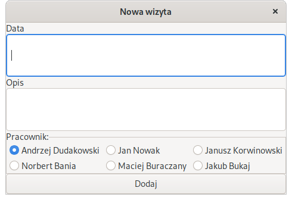

\newpage

# Opis projektu

Przygotowaliśmy projekt o temacie "e-warsztat". Przygotowany program ma ułatwiać
organizację pracy w serwisie samochodowym. Wykonaliśmy to zadanie przygotowując
program graficzny spełniający następujące funkcje:

- Baza klientów (lista klientów i danych o klientach)
- Baza pracowników
- Zapisywanie klientów na wizytę u konkretnego pracownika

Program został przygotowany przy użyciu biblioteki wxWidgets. Ta biblioteka
umożliwia przygotowanie aplikacji graficznych działających na systemach
operacyjnych Windows, MacOS oraz GNU/Linux. 

**Dokumentacja nie skupia się na poszczególnych klasach, lecz funkcjonalnościach
programu - kilka razy wraca do opisywania tej samej klasy. Uważamy, że w ten
sposób łatwiej zrozumieć implementację konkretnej funkcjonalności, która może
przydać do innego projektu, bez zapoznawania się z całą strukturą aplikacji.**

\newpage

# Interfejs graficzny

{width=70%}

Interfejs graficzny aplikacji przedstawiony na zdjęciu nr. 1 jest podzielony na
dwie połowy. Lewa połowa przedstawia graficzną reprezentację bazy danych
aplikacji.

Na szczycie lewego panelu znajdują się zakładki dla każdego typu
danych przechowywanych w aplikacji. Poniżej paska z zakładkami dla każdej
jednostki wybranego typu danych renderowany jest przycisk, którego naciśnięcie
sprawia wyświetlenie szczegółowych danych o tej jednostce w prawym panelu.

Prawy panel zawiera duże pole tekstowe, w którym wyświetlane są szczegółowe
informacje o przechowywanych danych. Ponadto, na spodzie prawego panelu znajdują
się trzy przyciski służące do:

- edycji danych, których szczegóły wyświetlane są powyżej
- umówienie klienta na wizytę (przycisk aktywny tylko, gdy wybrane dane są typu klient)
- usunięcia wybranych danych z aplikacji

# Implementacja

## Klasa aplikacji (wxApp)

### Protopyp klasy aplikacji (plik include/app.hpp):

```cpp
#pragma once

#include <wx/wx.h>
#include "frame.hpp"

class MyApp : public wxApp {
    public:
    MyFrame* main_frame;
    virtual bool OnInit();
};
```

### Implementacja (plik src/app.cpp):

```cpp
#include <wx/wx.h>
#include "../include/app.hpp"
#include "../include/frame.hpp"

wxIMPLEMENT_APP(MyApp);

bool MyApp::OnInit() {
    main_frame = new MyFrame(
        "Hello world", {50, 50}, {800, 600});
    main_frame->Show(true);
    return true;
}
```

Klasa aplikacji jest typowa dla aplikacji korzystających z biblioteki wxWidgets.
Jest to klasa (nazwana MyApp) dziedzicząca publicznie z klasy wxApp.
Implementuje metodę OnInit, w której tworzy instancję klasy MyFrame i wywołuje
jej metodę "Show".

## Klasa MyFrame

```cpp
#pragma once

#include <wx/wx.h>
#include "display_list.hpp"
#include "globals.hpp"

class MyFrame : public wxFrame {
    public:
    MyFrame(const wxString& title, const wxPoint& pos,
            const wxSize& size);
    private:
    void OnHello (wxCommandEvent& event);
    void OnExit  (wxCommandEvent& event);
    void OnAbout (wxCommandEvent& event);
    void OnSave  (wxCommandEvent& event);
    void OnOpen  (wxCommandEvent& event);
    void OnNew   (wxCommandEvent& event);

    wxDECLARE_EVENT_TABLE();
};

enum {
    ID_Hello = 1
};
```
 
Klasa MyFrame dziedziczy publicznie po klasie wxFrame. Metody, jakie
zaimplementowaliśmy w tej klasie to konstruktor i kilka metod obsługujących
wydarzenia.

- OnExit - funkcja obsługuje wybranie obcji exit w menubarze
- OnHello, OnAbout - funkcje obsługujące nazwane po sobie opcje w menubarze
  Wyświetlają informacje o programie
- OnSave, OnOpen - obsługują zapisywanie i wczytywanie danych do/z plików
- OnNew - funkcja obsługuje opcję stworzenia nowych danych

## Implementacja zapisywania i wczytywania danych

### Interfejs (klasa MyFrame)

```cpp
void MyFrame::OnOpen(wxCommandEvent& event) {
    wxFileDialog openFileDialog(this, _("Open XYZ file"), "", "",
                                "XYZ files (*.xyz)|*.xyz", wxFD_OPEN|wxFD_FILE_MUST_EXIST);

    if (openFileDialog.ShowModal() == wxID_CANCEL)
        return;
    
    std::ifstream stream;
    stream.open(openFileDialog.GetPath());
    if (stream.fail()) {
        wxLogError("Cannot open file " + openFileDialog.GetPath());
        return;
    }

    g_datastore.load(stream);
    g_display_list->display(0);
}

void MyFrame::OnSave(wxCommandEvent& event) {
    wxFileDialog 
        saveFileDialog(this, _("Save XYZ file"), "", "",
                       "XYZ files (*.xyz)|*.xyz", wxFD_SAVE|wxFD_OVERWRITE_PROMPT);
    if (saveFileDialog.ShowModal() == wxID_CANCEL)
        return;
    
    std::ofstream stream;
    stream.open(saveFileDialog.GetPath());
    if (stream.fail()) {
        wxLogError("Cannot open file " + saveFileDialog.GetPath());
        return;
    }

    g_datastore.save(stream);
}
```

**W tym miejscu zaimplementowany jest tylko interfejs graficzny zapisywania i
wczytywania danych. Prawdziwa implementacja znajduje się w klasie
`datastore_t`.**

---

Jest to typowa implementacja interfejsu wyboru pliku w bibliotece wxWidgets.
Niewiele różni się od przykładowej implementacji znajdującej się na wikipedii
biblioteki. Interfejs wyboru pliku nie jest przygotowany przez nas i różni się
prawie całkowicie na różnych systemach operacyjnych.

### "Prawdziwa" implementacja (klasa datastore_t)

Wszystkie informacje przechowywane w pamięci naszego programu znajdują się w
klasie `datastore_t`. Jedna instancja tej klasy używana jest w całym programie,
jako zmienna globalna `g_datastore`.

Klasa ta posiada `std::vector` dla każdego typu przechowywanych danych. Jej
prototyp wygląda tak:

```cpp
#pragma once

#ifndef DATA_STORE_HPP
#define DATA_STORE_HPP

#include <vector>
#include <iostream>
#include <wx/wx.h>

#include "data_classes.hpp"

class datastore_t {
    std::vector<customer_t> customers;
    std::vector<employee_t> employees;
    std::vector<appointment_t> appointments;

    int get_max_customer_id();
    int get_max_employee_id();
    int get_max_appointment_id();

    public:
    customer_t* get_customer(int);
    employee_t* get_employee(int);
    appointment_t* get_appointment(int);

    void add(employee_t);
    void add(customer_t);
    void add(appointment_t);

    void save(std::ostream& output);
    void load(std::istream& input);

    void delete_data(data_interface*);

    std::vector<customer_t>& get_customers();
    std::vector<employee_t>& get_employees();
    std::vector<appointment_t>& get_appointments();
};

#endif
```

`customer_t`, `employee_t` i `appointment_t` to struktury (klasy bez pól
prywatnych). Ich implementacja nie jest w tym miejscu ważna. Ważne jest to, że
dla każdej struktury przeciążono `operator<<` oraz `operator>>` dla
`std::ostream` i `std::istream`, co jest wykorzystywane w metodach save i load
klasy `datastore_t`.

Każda ze struktur dziedziczy tez po klasie `data_interface` co umożliwia pisanie
bardziej ogólnych klas przedstawiających informacje o danych w interfejsie
graficznym.

```cpp
struct data_interface {
    virtual std::string to_str() = 0;
    virtual std::string display_name() = 0;
};
```

Metoda `to_str` zwraca `std::string` zawierający wszystkie informacje zawarte w
strukturze. Ten ciąg znaków jest wyświetlany w interfejsie graficznym jako
`wxStaticText`. 

Metoda `display_name` zwraca krótki ciąg znaków służący do umieszczenia w
`wxButton` dla każdego elementu danych przechowywanych w aplikacji.

#### Implementacja metod `save` i `load`

```cpp
void datastore_t::save(std::ostream& output) {
    for (const customer_t& customer : customers) {
        output << "BEGIN CUSTOMER\n";
        output << customer << '\n';
    }
    for (const employee_t& employee : employees) {
        output << "BEGIN EMPLOYEE\n";
        output << employee << '\n';
    }
    for (const appointment_t& app : appointments) {
        output << "BEGIN APPOINTMENT\n";
        output << app << '\n';
    }
}

void datastore_t::load(std::istream& input) {
    customers.clear();
    employees.clear();
    appointments.clear(); // kasowanie wszystkich danych

    std::string current_line;
    while (input) {
        std::getline(input, current_line);
        if (current_line == "BEGIN CUSTOMER") {
            customer_t new_customer;
            input >> new_customer;
            customers.push_back(new_customer);
        } else if (current_line == "BEGIN EMPLOYEE") {
            employee_t new_employee;
            input >> new_employee;
            employees.push_back(new_employee);
        } else if (current_line == "BEGIN APPOINTMENT") {
            appointment_t app;
            input >> app;
            appointments.push_back(app);
        }
    }
}
```

Implementacja tych metod jest dość prosta. Plik, który powstaje w skutek zapisu
danych wygląda tak:

```
BEGIN CUSTOMER
2 Andrzej Syn_ciesli Galanteryjna Kielce Polska
BEGIN EMPLOYEE
4 Maciej Buraczany Rewolucji_pazdziernikowej Minsk Bialorus 2600
BEGIN APPOINTMENT
0 0 4 14-Maj-2013 Wymiana_samochodu
```

Przy zapisie `customer_t` oraz `employee_t` pierwszym słowem jest id tego
klienta lub pracownika. Wizyta, oprócz własnego, posiada też id klienta i
pracownika, do którego klient jest umówiony. Zapisywanie id jako liczb
całkowitych zamiast np. wskaźników na obiekty ułatwia usuwanie danych. Gdy
pracownik o zapisanym id został usunięty, w interfejsie zostanie wyświetlone
"nie można znaleźć osoby".

## Implementacja tworzenia nowych danych ("wyskakujące okienko")

Tworzenie nowych danych odbywa się po wciśnięciu opcji file > new w menubarze.
Wydarzenie to obsługuje funkcja OnNew w klasie MyFrame.

```cpp
void MyFrame::OnNew(wxCommandEvent& event) {
    new_data_window_t new_data_window {this};
    new_data_window.ShowModal();
}
```
 
`new_data_window` to wyskakujące okienko (klasa dziedziczy po `wxDialog`).
Metoda `ShowModal` powoduje wyświetlenie okienka i zablokowanie możliwości
interakcji z oknem głównym do czasu zamknięcia okna. W tym przypadku możliwe
jest zainicjalizowanie zmiennej na stosie (bez słowa `new`), bo okno i tak
zostanie zniszczone przed wyjściem z funkcji `OnNew`.

```cpp
#define CHOICE_NUMBER 2

class new_data_window_t : public wxDialog {

    std::unordered_map<std::string, wxTextCtrl*> input_fields;
    event_functor_t on_type_selected;
    event_functor_t on_commit;

    const wxString choices[CHOICE_NUMBER] = {"Customer", "Employee"};
    customer_t customer;
    employee_t employee;

    data_collector_t collector; // wytłumaczone później
    
    wxBoxSizer* main_sizer;
    wxChoice* choice_widget;
    public:
    new_data_window_t(wxWindow*);
};
```

Okno to pozwana na wybór pomiędzy tworzeniem nowego pracownika a tworzeniem
nowego klienta. Następnie w oknie wyświetlają się pola tekstowe dla każdego pola
w strukturach `customer_t` lub `employee_t`. Implementacja wygląda tak:

```cpp
new_data_window_t::new_data_window_t(wxWindow* parent) {
    this->Create(parent, wxNewId(), "Add new data");

    on_type_selected = [this] (wxEvent& event) {
        int selection = choice_widget->GetSelection();
        choice_widget->Disable();

        switch (selection) {
            case 0:
                add(collector, customer);
                break;
            case 1:
                add(collector, employee);
                break;
        }

        auto commit_button = new wxButton {this, wxNewId(), "commit"};
        main_sizer->Add(commit_button, wxSizerFlags{1}.Expand());

        SetSizerAndFit(main_sizer);

        this->Bind(wxEVT_BUTTON, this->on_commit);
    };

    on_commit = [this] (wxEvent& event) {
        if (!collector.collect()) return;
        int selection = choice_widget->GetSelection();
        switch (selection) {
            case 0:
                g_datastore.add(customer);
                break;
            case 1:
                g_datastore.add(employee);
                break;
        }
        this->Close(true);
    };

    main_sizer = new wxBoxSizer {wxVERTICAL};
    collector.set_sizer(main_sizer);
    choice_widget = new wxChoice {
                    this, wxNewId(),
                    wxDefaultPosition, wxDefaultSize,
                    CHOICE_NUMBER, this->choices };
    main_sizer->Add(choice_widget, wxSizerFlags{1});
    this->Bind(wxEVT_CHOICE, on_type_selected);

    SetSizerAndFit(main_sizer);
}
```

### Klasa `data_collector_t`

Wyświetlanie pól tekstowych do wstawiania danych i zapis tych danych do struktur
jest zrealizowany za pomocą klasy `data_collector_t`.

Ta klasa dostaje wskaźnik na `wxBoxSizer`, do którego będzie dodawała pola
tekstowe. Następnie można do niej dodawać wskaźnik na dane do zebrania oraz opis
pola tekstowego, który zostanie wyświetlony nad nim (`const char*`). Następnie,
przy wywołaniu metody `collect`, sczytuje dane z pól tekstowych i zapisuje je w
pamięci, na którą dostała wskaźnik. `collect` zwraca `false`, gdy nie udało się
zinterpretować danych z pola tekstowego jako `int`.

```cpp
class data_collector_t {
    wxBoxSizer* sizer = nullptr;
    std::vector<
        std::pair<wxTextCtrl*, std::string*>
    > str_vec;
    std::vector<
        std::pair<wxTextCtrl*, int*>
    > int_vec;
    wxTextCtrl* new_text_ctrl(const char*);
    public:
    void set_sizer(wxBoxSizer*);
    void add(std::string*, const char*);
    void add(int*, const char*);
    bool collect();
};

void add(data_collector_t&, customer_t&);
void add(data_collector_t&, employee_t&);
void add(data_collector_t&, appointment_t&);
```

funkcje `add` powyżej dodają każde pole struktur do kolektora za pomocą metody
`add`.

```cpp
void
data_collector_t::set_sizer(wxBoxSizer* sizer) {
    this->sizer = sizer;
}

void
data_collector_t::add(int* data, const char* label) {
    assert(this->sizer != nullptr);
    auto ctrl = new_text_ctrl(label);
    ctrl->SetValue(std::to_string(*data)); // kolektor ustawia 
    // wartośc w polu tekstowym na taką, jaka znajduje się aktualnie w pamięci,
    // przez co można go używać również do edycji już istniejących danych
    int_vec.push_back(
        std::pair<wxTextCtrl*, int*>{ctrl, data}
    );
}

void
data_collector_t::add(std::string* data, const char* label) {
    assert(this->sizer != nullptr);
    auto ctrl = new_text_ctrl(label);
    ctrl->SetValue(*data); // to samo, co komentarz wyżej
    str_vec.push_back(
        std::pair<wxTextCtrl*, std::string*>{ctrl, data}
    );
}

wxTextCtrl* 
data_collector_t::new_text_ctrl(const char* label) {
    auto ctrl = new wxTextCtrl {
        sizer->GetContainingWindow(),
        wxNewId()
    };
    sizer->Add(
        new wxStaticText{sizer->GetContainingWindow(), wxNewId(), label}
    );
    sizer->Add(ctrl, wxSizerFlags{1}.Expand());
    return ctrl;
}

bool
data_collector_t::collect() {
    assert(this->sizer != nullptr);
    bool ret = true;
    for (auto& i : str_vec) {
        *(i.second) = i.first->GetValue().ToStdString();
    }
    for (auto& i : int_vec) {
        int* dest = i.second;
        long tmp;
        if (!i.first->GetValue().ToLong(&tmp))
            ret = false;
        *dest = (int) tmp;
    }
    return ret;
}
```

Implementacja metod `add` klasy datastore_t:

```cpp
void datastore_t::add(customer_t customer) {
    customer.id = this->get_max_customer_id() + 1;
    customers.push_back(customer);
}

void datastore_t::add(employee_t employee) {
    employee.id = this->get_max_employee_id() + 1;
    employees.push_back(employee);
}
```

## Implementacja interfejsu graficznego

Na szczycie interfejsu znajduje się `wxBoxSizer` zawierający dwa elementy:

```cpp
        // Element funkcji MyFrame::OnInit
        auto sizer = new wxBoxSizer{wxHORIZONTAL};
        g_display_list = new display_list_t{this};
        sizer->Add(g_display_list, wxSizerFlags(1).Expand());
        g_detail_view = new detail_view{this};
        sizer->Add(g_detail_view, wxSizerFlags(1).Expand());
```

- `display_list_t g_display_list` - lewy panel interfejsu - tu znajduje się
  lista pracowników, klientów i wizyt
- `detail_view g_detail_view` - prawy panel interfejsu - tu znajdują się
  szczegółowe informacje o wybranej jednostce danych

### Implementacja klasy `display_list_t`

```cpp
typedef std::function<void(wxEvent&)> event_functor_t;
class display_list_t : public wxWindow {
    wxBoxSizer* main_sizer;
    wxBoxSizer* top_sizer;
    std::map<std::string, wxButton*> buttons;

    button_list* butlist;

    event_functor_t on_category;
    event_functor_t on_detail; // nie używany

    void clear_items();

    public:
    display_list_t(wxWindow*);
    void display(int type);
};
```

Klasa zawiera dwa sizery: `main_sizer` to sizer zawierający `top_sizer` oraz
okno `button_list`, a `top_sizer` zawiera trzy przyciski służące do wyboru
rodzaju danych wyświetlanych w `button_list`. `button_list` to dość prosta klasa
składająca się z sizera, do którego dodaje przycisk dla każdej dodanej za
pomocą metody `add` jednostki danych.

```cpp
display_list_t::display_list_t(wxWindow* parent) {
    Create(parent, wxNewId(), wxDefaultPosition, wxSize{500, 500});

    on_category = [this] (wxEvent& event) {
        auto button = (wxButton*) event.GetEventObject();
        for (auto& but : buttons) but.second->Enable();
        button->Disable();

        clear_items();
        if (button == buttons["customers"])    display(0);
        if (button == buttons["employees"])    display(1);
        if (button == buttons["appointments"]) display(2);      
    };

    main_sizer = new wxBoxSizer{wxVERTICAL};
    top_sizer = new wxBoxSizer{wxHORIZONTAL};

    buttons["customers"] = new wxButton{this, wxNewId(), "Klienci"};
    buttons["employees"] = new wxButton{this, wxNewId(), "Pracownicy"};
    buttons["appointments"] = new wxButton{this, wxNewId(), "Wizyty"};
    for (auto& button : buttons) {
        button.second->Bind(wxEVT_BUTTON, on_category);
        top_sizer->Add(button.second, wxSizerFlags(1).Expand());
    }

    butlist = new button_list{this};
    butlist->draw();

    main_sizer->Add(top_sizer, wxSizerFlags(0).Expand());
    main_sizer->Add(butlist, wxSizerFlags(1).Expand());

    SetSizerAndFit(main_sizer);
}

void display_list_t::clear_items() {
    butlist->clear_all();
}

void display_list_t::display(int type) {
    if (type == 0) buttons["customers"]->Disable();

    clear_items();

    if (type == 0) for (auto& cust : g_datastore.get_customers())
        butlist->add_button(&cust);
    if (type == 1) for (auto& empl : g_datastore.get_employees())
        butlist->add_button(&empl);
    if (type == 2) for (auto& appt : g_datastore.get_appointments())
        butlist->add_button(&appt);
    
    butlist->draw();
}
```

### Implementacja klasy `button_list` (`wxScrolledWindow`)

```cpp
class button_list : public wxScrolledWindow {
    wxBoxSizer* main_sizer;

    public:
    button_list(wxWindow*);
    void add_button(data_interface*);
    void clear_all();
    void draw();
};

button_list::button_list(wxWindow* parent) {
    Create(parent, wxNewId(), wxDefaultPosition, wxSize{400, 400});
    main_sizer = new wxBoxSizer{wxVERTICAL};
}

void button_list::add_button(data_interface* data) {
    auto button = new data_button{data, this};
    main_sizer->Add(button, wxSizerFlags(0).Expand());
}

void button_list::clear_all() {
    main_sizer->Clear(true);
}

void button_list::draw() {
    wxSize size = m_targetWindow->GetBestVirtualSize();
    m_win->SetVirtualSize( size );
    this->SetSizer(main_sizer);
    this->FitInside();
    this->SetScrollRate(5, 5);
}
```

Zawartość metody `draw` skopiowana z <https://wiki.wxwidgets.org/Scrolling>

Funkcjonalność zmieniania zawartości prawego panelu (widoku szczegółowego)
zawarta jest w klasie `data_button`, której używa klasa `buttons_list`.

### Implementacja klasy `data_button`

```cpp
class data_button : public wxButton {
    data_interface* data;
    public:
    data_button(data_interface*, wxWindow*);
    data_interface* get_data();
};

data_button::data_button(data_interface* data, wxWindow* parent) {
    this->data = data;
    Create(parent, wxNewId(), data->display_name());
    Bind(wxEVT_BUTTON, [this] (wxEvent& event) {
        g_detail_view->set_data(this->data);
        // g_detail_view to zmienna globalna reprezentująca
        // prawy panel interfejsu graficznego
    });
}

data_interface* data_button::get_data() {
    return this->data;
}
```

### Implementacja `detail_view` - prawego panelu z widokiem szczegółowym

```cpp
class detail_view : public wxWindow {
    event_functor_t on_edit;
    event_functor_t on_appointment;
    event_functor_t on_delete;

    wxButton* edit_button;
    wxButton* appointment_button;
    wxButton* delete_button;

    wxBoxSizer* main_sizer;
    data_interface* data;
    wxStaticText* text_widget;

    public:
    detail_view(wxWindow*);
    void set_data(data_interface*);
    void show_data();
};  
```

---

Prawy panel wyświetla wynik wywołania metody `data_interface::to_str`, która
zwraca ciąg znaków zawierający wszystkie dane zawarte w jednostce danych. Ciąg
znaków jest wyświetlany w widżecie `wxStaticText`.

Na spodzie prawego panelu zawarte są 3 przyciski. Przycisk umawiający na wizytę
działa tylko, gdy wybrane dane przedstawiają klienta.

---

```cpp
detail_view::detail_view(wxWindow* parent) {
    this->data = nullptr;
    Create(parent, wxNewId());

    this->on_edit = [this] (wxEvent& event) {
        auto edit_window = new edit_window_t{nullptr, this->data};
        edit_window->ShowModal();
        g_display_list->display(0);
    };

    this->on_appointment = [this] (wxEvent& event) {
        auto appointment = new new_appointment{
            this, dynamic_cast<customer_t*>(this->data)};
        appointment->ShowModal();
    };

    this->on_delete = [this] (wxEvent& event) {
        if (this->data == nullptr) {
            std::cout << "deleting nullptr" << std::endl;
            return;
        }
        g_datastore.delete_data(this->data);
        g_display_list->display(0);
    };

    main_sizer = new wxBoxSizer{wxVERTICAL};
    main_sizer->Add(
        new wxStaticText{
            this, wxNewId(), "Widok szczegolowy"
        },
        wxSizerFlags(0).Expand()
    );

    this->text_widget = new wxStaticText{this, wxNewId(), "..."};
    main_sizer->Add(this->text_widget, wxSizerFlags(1).Expand());

    this->edit_button = new wxButton{this, wxNewId(), "Edytuj"};
    edit_button->Bind(wxEVT_BUTTON, on_edit);

    this->appointment_button = new wxButton{this, wxNewId(), "Stworz wizyte"};
    appointment_button->Bind(wxEVT_BUTTON, on_appointment);

    this->delete_button = new wxButton{this, wxNewId(), "Usun"};
    delete_button->Bind(wxEVT_BUTTON, on_delete);
    this->delete_button->SetBackgroundColour(wxColor{255, 200, 200});

    main_sizer->Add(edit_button, wxSizerFlags(0).Expand());
    main_sizer->Add(appointment_button, wxSizerFlags(0).Expand());
    main_sizer->Add(delete_button, wxSizerFlags(0).Expand());

    for (auto but : {edit_button, appointment_button, delete_button})
        but->Disable();

    SetSizerAndFit(main_sizer);
}

void detail_view::set_data(data_interface* data) {
    this->data = data;
    std::cout << data->to_str() << std::endl;
    show_data();
}

void detail_view::show_data() {
    if (this->data == nullptr) {
        std::cout << "showing data for nullptr" << std::endl;
        return;
    }

    this->text_widget->SetLabel(data->to_str());

    appointment_button->Disable();
    customer_t* ptr = dynamic_cast<customer_t*>(this->data);
    if (ptr != nullptr) appointment_button->Enable();

    edit_button->Enable();
    delete_button->Enable();
}
```

---

Klasa `detail_view` przy edycji oraz umawianiu na wizytę używa innych klas:

- `new_appointment`
- `edit_window_t`

### Implementacja `edit_window_t` - okna do edycji istniejących danych

Klasa przypomina `new_data_widow_t`

```cpp
class edit_window_t : public wxDialog {
    event_functor_t on_commit;
    data_interface* data;
    wxBoxSizer* main_sizer;
    data_collector_t collector;

    public:
    edit_window_t(wxWindow*, data_interface*);
};

edit_window_t::edit_window_t(wxWindow* parent, data_interface* data) {
    this->data = data;
    Create(parent, wxNewId(), "Edytuj dane");

    main_sizer = new wxBoxSizer{wxVERTICAL};
    SetSizer(main_sizer);
    collector.set_sizer(main_sizer);

    this->on_commit = [this] (wxEvent& event) {
        if (!collector.collect()) return;
        g_display_list->display(0);
        this->Close(true);
    };

    customer_t* customer = dynamic_cast<customer_t*>(data);
    employee_t* employee = dynamic_cast<employee_t*>(data);
    appointment_t* appointment = dynamic_cast<appointment_t*>(data);

    if (customer)    add(collector, *customer);
    if (employee)    add(collector, *employee);
    if (appointment) add(collector, *appointment);

    auto button = new wxButton{this, wxNewId(), "Zatwierdz"};
    main_sizer->Add(button, wxSizerFlags(0).Expand());
    button->Bind(wxEVT_BUTTON, on_commit);

    SetSizerAndFit(main_sizer);
}
```

\newpage

### Implementacja klasy `new_appointment`

{width=50%}

```cpp
class new_appointment : public wxDialog {
    std::function<void(wxEvent&)> on_commit;
    wxRadioBox* radio;
    appointment_t appointment;
    data_collector_t collector;
    wxArrayString options;
    public:
    new_appointment(wxWindow*, customer_t*);
};
```

\newpage

```cpp
new_appointment::new_appointment(
    wxWindow* parent, customer_t* customer) {
    Create(parent, wxNewId(), "Nowa wizyta");

    auto sizer = new wxBoxSizer{wxVERTICAL};
    SetSizer(sizer);

    collector.set_sizer(sizer);
    add(collector, appointment);

    auto employees = g_datastore.get_employees();
    for (auto& empl : employees)
        options.Add(empl.display_name());
    
    radio = new wxRadioBox{
        this, wxNewId(), "Pracownik:",
        wxDefaultPosition, wxDefaultSize,
        options, 3
    };
    sizer->Add(radio, wxSizerFlags(1).Expand());

    auto commit = new wxButton{this, wxNewId(), "Dodaj"};
    sizer->Add(commit, wxSizerFlags(0).Expand());

    on_commit = [this, customer] (wxEvent& event) {
        if (!collector.collect()) return;
        auto empl_id = radio->GetSelection();
        if (empl_id == wxNOT_FOUND) return;
        appointment.employee_id = 
            g_datastore.get_employees()[empl_id].id;
        appointment.customer_id = customer->id;
        g_datastore.add(appointment);
        this->Close(true);
    };

    commit->Bind(wxEVT_BUTTON, on_commit);

    SetSizerAndFit(sizer);
}
```

Jak wspomnieliśmy wcześniej, klasa używa `data_collector` - tak samo jak klasa
do tworzenia nowych danych.

Pierwszy raz w programie użyliśmy `wxRadioBox`. Jest to widżet użyty do wyboru
mechanika.


\newpage

# Wnioski

Przygotowanie tego projektu pozwoliło nam wykorzystać w praktycę wiedzę o
programowaniu obiektowym.

Nauczyliśmy się jak założenia tego paradygmatu pomagają w organizacji dużych
projektów. Napisanie takiego programu w języku nie wspierającym OOP byłoby dużo
trudniejsze. 

Wykorzystując założenia jak:

- abstrakcja
- hermetyzacja
- polimorfizm
- dziedziczenie

Napisaliśmy nasz największy program dotychczas bez rezygnowania z pisania
czytelnego i przejrzystego kodu źródłowego.

Programowanie obiektowe jest praktycznie niezbędne, jeśli programista chce
zbudować interfejs graficzny.

\newpage

# Inne

## Zmienne globalne

W programie używaliśmy kilku zmiennych globalnych:

- include/globals.hpp

```cpp
class display_list_t;
class detail_view;

typedef std::function<void(wxEvent&)> event_functor_t;

extern datastore_t g_datastore;
extern display_list_t* g_display_list;
extern detail_view* g_detail_view;
```

---

- src/globals.cpp


```cpp
#include "../include/globals.hpp"
#include "../include/data_store.hpp"

datastore_t g_datastore;

display_list_t* g_display_list = nullptr;

detail_view* g_detail_view = nullptr;
```

## Szczegółowa implementacja `datastore_t`

```cpp
class datastore_t {
    std::vector<customer_t> customers;
    std::vector<employee_t> employees;
    std::vector<appointment_t> appointments;

    int get_max_customer_id();
    int get_max_employee_id();
    int get_max_appointment_id();

    public:
    customer_t* get_customer(int);
    employee_t* get_employee(int);
    appointment_t* get_appointment(int);

    void add(employee_t);
    void add(customer_t);
    void add(appointment_t);

    void save(std::ostream& output);
    void load(std::istream& input);

    void delete_data(data_interface*);

    std::vector<customer_t>& get_customers();
    std::vector<employee_t>& get_employees();
    std::vector<appointment_t>& get_appointments();
};

#include "../include/data_store.hpp"
#include <string>
#include <algorithm>
#include <iostream>

void datastore_t::save(std::ostream& output) {
    for (const customer_t& customer : customers) {
        output << "BEGIN CUSTOMER\n";
        output << customer << '\n';
    }
    for (const employee_t& employee : employees) {
        output << "BEGIN EMPLOYEE\n";
        output << employee << '\n';
    }
    for (const appointment_t& app : appointments) {
        output << "BEGIN APPOINTMENT\n";
        output << app << '\n';
    }
}

void datastore_t::load(std::istream& input) {
    customers.clear();
    employees.clear();
    appointments.clear();

    std::string current_line;
    while (input) {
        std::getline(input, current_line);
        if (current_line == "BEGIN CUSTOMER") {
            customer_t new_customer;
            input >> new_customer;
            customers.push_back(new_customer);
        } else if (current_line == "BEGIN EMPLOYEE") {
            employee_t new_employee;
            input >> new_employee;
            employees.push_back(new_employee);
        } else if (current_line == "BEGIN APPOINTMENT") {
            appointment_t app;
            input >> app;
            appointments.push_back(app);
        }
    }
}

int datastore_t::get_max_customer_id() {
    int max = -1;
    for (const auto& customer : customers)
        max = std::max(customer.id, max);
    return max;
}

int datastore_t::get_max_employee_id() {
    int max = -1;
    for (const auto& employee : employees)
        max = std::max(employee.id, max);
    return max;
}

int datastore_t::get_max_appointment_id() {
    int max = -1;
    for (const auto& appointment : appointments)
        max = std::max(appointment.id, max);
    return max;
}

void datastore_t::add(customer_t customer) {
    customer.id = this->get_max_customer_id() + 1;
    customers.push_back(customer);
}

void datastore_t::add(employee_t employee) {
    employee.id = this->get_max_employee_id() + 1;
    employees.push_back(employee);
}

void datastore_t::add(appointment_t appointment) {
    appointment.id = this->get_max_appointment_id() + 1;
    appointments.push_back(appointment);
}

customer_t* datastore_t::get_customer(int id) {
    for (auto& customer : customers)
        if (customer.id == id) return &customer;
    return nullptr;
}

employee_t* datastore_t::get_employee(int id) {
    for (auto& employee : employees)
        if (employee.id == id) return &employee;
    return nullptr;
}

appointment_t* datastore_t::get_appointment(int id) {
    for (auto& appointment : appointments)
        if (appointment.id == id) return &appointment;
    return nullptr;
}

void datastore_t::delete_data(data_interface* data) {
    customer_t* customer = dynamic_cast<customer_t*>(data);
    employee_t* employee = dynamic_cast<employee_t*>(data);
    appointment_t* appointment = dynamic_cast<appointment_t*>(data);

    if (customer) {
        for (auto iter = customers.begin(); iter != customers.end(); iter++) {
            if (customer == &(*iter)) {
                customers.erase(iter);
                return;
            }
        }
    }

    if (employee) {
        for (auto iter = employees.begin(); iter != employees.end(); iter++) {
            if (employee == &(*iter)) {
                employees.erase(iter);
                return;
            }
        }
    }

    if (appointment) {
        for (auto iter = appointments.begin(); iter != appointments.end(); iter++) {
            if (appointment == &(*iter)) {
                appointments.erase(iter);
                return;
            }
        }
    }

    std::cout << "Nie usunięto elementu!!!" << std::endl;
}

std::vector<customer_t>& datastore_t::get_customers() {
    return customers;
};

std::vector<employee_t>& datastore_t::get_employees() {
    return employees;
};

std::vector<appointment_t>& datastore_t::get_appointments() {
    return appointments;
};
```

## Implementacja struktur przechowujących dane

```cpp
#include <string>
#include <sstream>

struct data_interface {
    virtual std::string to_str() = 0;
    virtual std::string display_name() = 0;
};

struct address_t {
    std::string street, city, country;
};

inline std::ostream& operator<<(std::ostream& stream, const address_t& address) {
    stream << address.street  << ' '
           << address.city    << ' '
           << address.country;
    return stream;
}

inline std::istream& operator>>(std::istream& stream, address_t& address) {
    stream >> address.street
           >> address.city
           >> address.country;
    return stream;
}

struct name_t {
    std::string name, surname;
};

inline std::ostream& operator<<(std::ostream& stream, const name_t& name) {
    stream << name.name    << ' '
           << name.surname;
    return stream;
}

inline std::istream& operator>>(std::istream& stream, name_t& name) {
    stream >> name.name
           >> name.surname;
    return stream;
}

struct personal_t {
    name_t name;
    address_t address;
};

inline std::ostream& operator<<(std::ostream& stream, const personal_t& personal) {
    stream << personal.name    << ' '
           << personal.address;
    return stream;
}

inline std::istream& operator>>(std::istream& stream, personal_t& personal) {
    stream >> personal.name
           >> personal.address;
    return stream;
}

struct customer_t : public data_interface{
    int id = 0;
    personal_t personal;

    std::string display_name();
    std::string to_str();
};

inline std::ostream& operator<<(std::ostream& stream, const customer_t& customer) {
    stream << customer.id       << ' '
           << customer.personal;
    return stream;
}

inline std::istream& operator>>(std::istream& stream, customer_t& customer) {
    stream >> customer.id
           >> customer.personal;
    return stream;
}

struct employee_t : public data_interface {
    int id = 0;
    personal_t personal;
    int salary = 0;

    std::string display_name();
    std::string to_str();
};

inline std::ostream& operator<<(std::ostream& stream, const employee_t& employee) {
    stream << employee.id       << ' '
           << employee.personal << ' '
           << employee.salary;
    return stream;
}

inline std::istream& operator>>(std::istream& stream, employee_t& employee) {
    stream >> employee.id
           >> employee.personal
           >> employee.salary;
    return stream;
}

struct appointment_t : public data_interface {
    int id;
    int customer_id, employee_id;

    std::string date;
    std::string description;

    std::string to_str();
    std::string display_name();
};

inline std::ostream& operator<<(std::ostream& stream, 
                                const appointment_t& app) {
    auto desc_tmp = app.description;
    for (char& ch : desc_tmp) if (ch == ' ') ch = '_';

    stream << app.id << ' ' << app.customer_id 
           << ' ' << app.employee_id << ' '
           << app.date << ' ' << desc_tmp;
    return stream;
}

inline std::istream& operator>>(std::istream& stream,
                                appointment_t& app) {
    std::string desc_tmp;

    stream >> app.id >> app.customer_id >> app.employee_id
           >> app.date >> desc_tmp;

    for (char& ch : desc_tmp) if (ch == '_') ch = ' ';
    app.description = desc_tmp;

    return stream;
}

#include "../include/data_classes.hpp"
#include "../include/globals.hpp"

std::string customer_t::display_name() {
    return personal.name.name + ' ' + personal.name.surname;
}

std::string employee_t::display_name() {
    return personal.name.name + ' ' + personal.name.surname;
}

std::string customer_t::to_str() {
    std::stringstream stream;
    
    stream << "Id: " << id << '\n';
    stream << "Imie: " << personal.name.name << '\n';
    stream << "Nazwisko: " << personal.name.surname << '\n';
    stream << "Ulica: " << personal.address.street << '\n';
    stream << "Miasto: " << personal.address.city << '\n';
    stream << "Kraj: " << personal.address.country << '\n';

    return stream.str();
}

std::string employee_t::to_str() {
    std::stringstream stream;
    
    stream << "Id: " << id << '\n';
    stream << "Pensja: " << salary << '\n';
    stream << "Imie: " << personal.name.name << '\n';
    stream << "Nazwisko: " << personal.name.name << '\n';
    stream << "Ulica: " << personal.address.street << '\n';
    stream << "Miasto: " << personal.address.city << '\n';
    stream << "Kraj: " << personal.address.country << '\n';

    return stream.str();
}

std::string appointment_t::to_str() {
    std::stringstream stream;

    customer_t* customer = g_datastore.get_customer(customer_id);
    employee_t* employee = g_datastore.get_employee(employee_id);

    stream << "Wizyta o id " << this->id << '\n';
    stream << "Klient:\n"
        << ((customer) ? customer->to_str() 
                       : "Nie znaleziono klienta") << '\n';
    stream << "Pracownik:\n"
        << ((employee) ? employee->to_str() 
                       : "Nie znaleziono pracownika") << '\n';
    stream << "Opis:\n" << this->description << '\n';
    stream << "Data:\n" << this->date << '\n';
    return stream.str();
}

std::string appointment_t::display_name() {
    return std::to_string(id) + ": " + date;
}
```