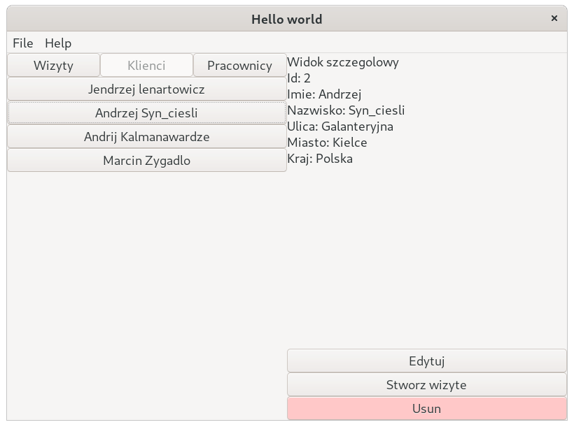

\newpage

# Opis projektu

Przygotowaliśmy projekt o temacie "e-warsztat". Przygotowany program ma ułatwiać
organizację pracy w serwisie samochodowym. Wykonaliśmy to zadanie przygotowując
program graficzny spełniający następujące funkcje:

- Baza klientów (lista klientów i danych o klientach)
- Baza pracowników
- Zapisywanie klientów na wizytę u konkretnego pracownika

Program został przygotowany przy użyciu biblioteki wxWidgets. Ta biblioteka
umożliwia przygotowanie aplikacji graficznych działających na systemach
operacyjnych Windows, MacOS oraz GNU/Linux. 

\newpage

# Interfejs graficzny

{width=70%}

Interfejs graficzny aplikacji przedstawiony na zdjęciu nr. 1 jest podzielony na
dwie połowy. Lewa połowa przedstawia graficzną reprezentację bazy danych
aplikacji.

Na szczycie lewego panelu znajdują się zakładki dla każdego typu
danych przechowywanych w aplikacji. Poniżej paska z zakładkami dla każdej
jednostki wybranego typu danych renderowany jest przycisk, którego naciśnięcie
sprawia wyświetlenie szczegółowych danych o tej jednostce w prawym panelu.

Prawy panel zawiera duże pole tekstowe, w którym wyświetlane są szczegółowe
informacje o przechowywanych danych. Ponadto, na spodzie prawego panelu znajdują
się trzy przyciski służące do:

- edycji danych, których szczegóły wyświetlane są powyżej
- umówienie klienta na wizytę (przycisk aktywny tylko, gdy wybrane dane są typu klient)
- usunięcia wybranych danych z aplikacji

# Implementacja

## Klasa aplikacji (wxApp)

### Protopyp klasy aplikacji (plik include/app.hpp):

```cpp
#pragma once

#include <wx/wx.h>
#include "frame.hpp"

class MyApp : public wxApp {
    public:
    MyFrame* main_frame;
    virtual bool OnInit();
};
```

### Implementacja (plik src/app.cpp):

```cpp
#include <wx/wx.h>
#include "../include/app.hpp"
#include "../include/frame.hpp"

wxIMPLEMENT_APP(MyApp);

bool MyApp::OnInit() {
    main_frame = new MyFrame(
        "Hello world", {50, 50}, {800, 600});
    main_frame->Show(true);
    return true;
}
```

